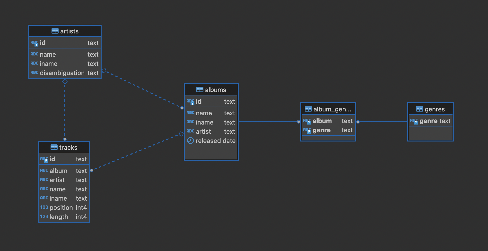

# Clojure koulutus 2023-01-14

## Links

- [Try Clojure](https://tryclojure.org) ClojureScript REPL on web
- [Clojure API](https://clojure.org/api/api) Official API docs
- [ClojureDocs](https://clojuredocs.org) Community docs with examples etc.
- [ClojureScript API](http://cljs.github.io/api/) ClojureScript API docs
- [Google Closure API](https://google.github.io/closure-library/api/) Commonly used Closure lib
- [Shadow-cljs](https://shadow-cljs.github.io/docs/UsersGuide.html) Shadow-cljs build tool docs

## Dataset

Esimerkit käyttävät julkista [MusicBrainz](https://musicbrainz.org) musiikin tietovarastoa.
Koko MusicBrainz aineisto on todella suuri ja rakenteeltaan melko monimutkainen. Siksi
tässä käytetään aineiston osaa joka on jäsennelty alkuperäistä yksinkertaisemmin.

Tietomalli on seuraavan muotoinen:


## Aloitus

Käynnistä tietokanta ja palvelin komennolla:

```bash
$ docker compose up
```
